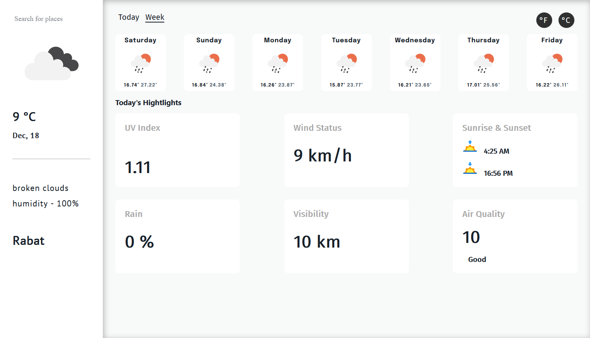

## ⛅ Weathely 

I made this smple react app as I was learning React using [Create React App](https://github.com/facebook/create-react-app).

## ✅ Demo

The app shows weather state in a specific location worldwide depending on the user search.

- I used **openweathermap**'s API to fetch latest data.

- And used **axios** for making promise based Http request to interact with the API.
  

## ✅ Install 
- Create .env file and add `REACT_APP_APIKEY=xxxxxxxxxx` to it with your **openweathermap** api key.
- Clone the project.
- Then run `yarn install` to install the dependecies.
- After that run `yarn start` to run the app in **development mode**.
- Open [http://localhost:3000](http://localhost:3000) to view it in the browser.
